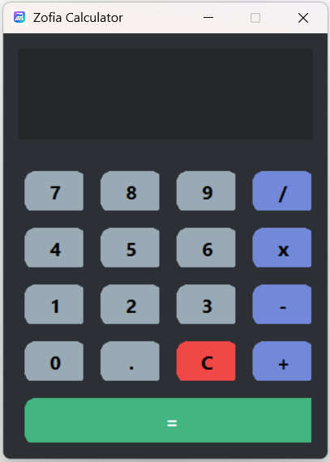

# zofia-calculator

Zofia Calculator is a modern Python calculator application for Windows.
It features a clean UI, keyboard input, animated results, and error handling.

## ✨ Features
- Rounded buttons
- Keyboard support (Enter, Backspace)
- Result slide animation
- Error shake animation
- Animated calculation results
- Custom window icon
- Built with Python (Tkinter)

## 🖥️ Screenshot


## 🖥 Requirements
- Windows 10 / 11 (64-bit)

## 🚀 Download
You can download the Windows installer from the **Releases** section.

## Keywords
Zofia Calculator, Python calculator, Windows calculator app, Tkinter calculator

## 🛠 Built With
- Python 3.10
- Tkinter
- PyInstaller / Nuitka

## 📜 License
MIT License

## 🚀 How to Run
```bash
Installation Setup File
